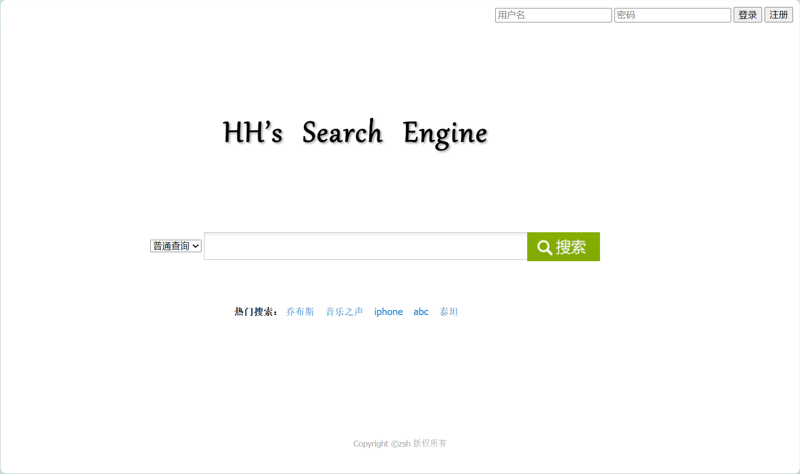

# movie-search-engine
final project for IR

## 网页抓取

利用beautifulsoup4库进行网页抓取，抓取的网页为[豆瓣电影](https://movie.douban.com/)的电影信息以及影评信息。

抓取网页的起始点为[豆瓣电影250](https://movie.douban.com/top250)的前10页，每页25部电影，共250部电影。随后根据这些电影找到相关的电影、影评，每条电影的影评数量不超过10条。最后对于相关的电影重复上述过程，直到抓取到的电影数达到2500部。

最后，收集了2503部电影，共计影评数为23515条。将这些数据存储在`data`文件夹下，并保存到本地mysql数据库中。

下面是数据库的截图：


## 建立索引

利用elasticseach建立对于爬取到的锚文本、网页内容建立索引，并使用了logstash工具进行与数据库的自动同步。

下面稍微介绍一下我对于logstash的使用：

```bash
input {
    stdin {
    }
    jdbc {
      # 数据库  数据库名称为ESDB，表名为movies
      jdbc_connection_string => "jdbc:mysql://localhost:3306/ir_db"
      # 用户名密码
      jdbc_user => "root"
      jdbc_password => "******"
      # jar包的位置
      jdbc_driver_library => "D:/elasticsearch-8.11.1-windows-x86_64/logstash-8.11.1/mysql-connector-j-8.2.0.jar"
      # mysql的Driver
      jdbc_driver_class => "com.mysql.jdbc.Driver"
      jdbc_paging_enabled => "true"
      jdbc_page_size => "50000"
      # sql文件位置 没有可以不写
      #statement_filepath => "config-mysql/movies.sql"
      statement => "select * from movies"
      # 设置定时任务间隔  含义：分、时、天、月、年，全部为*默认含义为每分钟跑一次任务
      schedule => "* * * * *"
	  #索引的类型
      type => "movies"
    }
}

output {
    elasticsearch {
        hosts => "127.0.0.1:9200"
        # index名
		index => "movies"
		# 关联的数据库中有有一个id字段，对应索引的id号
        document_id => "%{id}"
    }
    stdout {
        codec => json_lines
    }
}
```

由此得到了对于电影以及影评的索引。


## 链接分析

首先需要爬取网页的链接关系，我仍然是从[豆瓣250](https://movie.douban.com/top250)开始，分析每个网页中所有的链接，加入到全局的集合中，并将其中的新链接加入到待爬取的队列中。

就这样，爬取了20万个网页链接关系。这些链接关系大都将把我爬到的电影以及影评链接覆盖了。随后调用库函数计算出每个网页的PageRank值，将其存储在数据库中。

相关的代码在craw.ipynb以及pagerank.py中。

## 查询服务

通过elasticsearch的接口以及数据库接口为用户提供**站内查询、短语查询、通配查询、查询⽇志**的查询服务。

### 站内查询、短语查询、通配查询

在query.py中实现了这三种查询，三种查询均使用了elasticsearch的接口。

```python
# code/query.py
class Query:

    # 初始化
    def __init__(self, str, user_id = -1, type = 'normal'):
        ''' ...some code here... '''
        
    # 站内查询
    def site_search(self, url):
        self.use_site_search = True
        self.site = url

    # 短语查询
    def phrase_search(self, query):
        query["query"]["function_score"]["query"].update({'bool':{'should':[
            {'match_phrase':{'标题':self.str}}, 
            {'match_phrase':{'电影名':self.str}}
            ]}})
        return query
        

    # 通配查询
    def wildcard_search(self, query):
        query["query"]["function_score"]["query"].update({'bool':{'should':[
            {'wildcard':{'标题':self.str}}, 
            {'wildcard':{'电影名':self.str}}
            ]}})
        return query

    def search(self, start = 0, size = 10):
        ''' ...some code here... '''
```

### 查询日志

在query.py以及database.py中实现了查询日志的记录，通过mysql记录了用户的查询内容、查询时间、查询结果、查询类型、用户id等信息。

```python
# code/database.py
def create_query_log_table():
    sql = """
        CREATE TABLE IF NOT EXISTS query_log (
            id INT(11) PRIMARY KEY AUTO_INCREMENT,
            user_id INT(11),
            query MEDIUMTEXT NOT NULL,
            timestamp DATETIME NOT NULL,
            FOREIGN KEY(user_id) REFERENCES users(id)
        ) ENGINE=InnoDB DEFAULT CHARSET=utf8mb4
    """
    cursor.execute(sql)

# code/query.py
    # 查询日志
    def do_log(self):
        user_id = self.user_id
        
        type_str = self.search_type.upper()
        type_str = '[' + type_str + ']'

        if self.use_site_search:
            type_str = type_str + ' site:' + self.site
        
        query = type_str + ' ' + self.str
        timestamp = datetime.datetime.now()  # 查询的时间

        # 调用之前定义的insert_log函数来插入日志
        insert_query_log(user_id, query, timestamp)
```

当然，查询日志的实现少不了对于用户登录系统的实现，于是也建立了用户表，记录了用户的id、用户名、密码等信息。并通过与数据库进行交互在web网页中实现了用户的登录、注册的功能。

## 个性化查询

### 文本聚类分析

通过对于爬取到的影评以及电影进行文本聚类分析，可以得到每个影评和电影的主题，从而为用户提供更加精准的查询服务。

在recommend.ipynb中实现了对于影评的聚类分析，通过对于文本的分词、去停用词、词干提取、词向量化、降维、聚类等步骤，将影评聚类为20个类别。

这一部分的工作主要通过sklearn库来实现。调用了sklearn中的TfidfVectorizer、KMeans、PCA等函数。训练好模型后，将其保存在本地，以便后续使用。

### 用户偏好分析

通过对于用户的查询日志进行分析，可以得到用户的偏好，从而为用户提供个性化的查询服务。

首先，通过对于用户的查询日志进行分析，可以得到用户的查询偏好，即用户经常查询的关键词。这里我使用了jieba库进行分词，通过对于用户的查询日志进行分词。

随后用上一步训练好的词向量模型将其转化为向量，以及上一步得到的kmeans模型将其聚类，得到用户的查询偏好。将这些类别的分数相应的提高，从而为用户提供个性化的查询服务。相关代码在recommend.py中。

## Web图形化页面

通过Flask框架并编写相应的html代码实现了网页的图形化界面，用户可以通过网页进行查询、登录、注册等操作。

下面是网页的截图：

网页主页：


查询结果：


## 个性化推荐

通过对于用户的查询内容进行分析，从而得到与用户查询内容相似的电影/影评，为用户提供个性化的推荐服务。

这部分的工作使用了`gensim.models `中的` word2vec, Word2Vec`模型，对于电影以及影评的文本进行分词、去停用词、词干提取、词向量化等步骤，得到每个电影/影评的词向量。

随后，通过计算用户查询内容的词向量与每个电影/影评的词向量的余弦相似度，得到与用户查询内容相似的电影/影评。